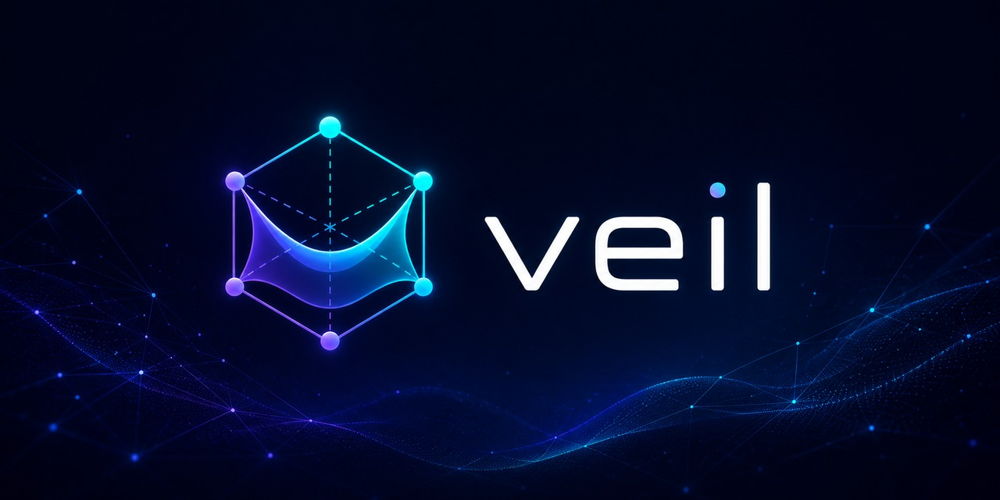

<p align="center">
  
</p>

# Veil (OVL1)

A decentralized, censorship-resistant hybrid veil network written in Rust,
implementing the **OVL1** protocol — sovereign identities, a Kademlia DHT,
post-quantum-hybrid crypto, pluggable obfuscated transports, and IP/proxy
gateways.

## Install

**Linux / macOS:**

```sh
curl --proto '=https' --tlsv1.2 -sSf \
  https://raw.githubusercontent.com/veilnetwork/veil/main/scripts/install.sh | sh
```

**Windows (PowerShell):**

```powershell
irm https://raw.githubusercontent.com/veilnetwork/veil/main/scripts/install.ps1 | iex
```

This installs prebuilt, sha256-verified binaries into `~/.veil/bin`
(`%USERPROFILE%\.veil\bin` on Windows) — no Rust toolchain needed.

Want the gateway and proxy tools too? Add `--all` (or `-All` on Windows):

```sh
curl -sSf https://raw.githubusercontent.com/veilnetwork/veil/main/scripts/install.sh | sh -s -- --all
```

Full guide, options, server setup, and uninstall: **[docs/en/install.md](docs/en/install.md)**
· на русском: **[docs/ru/install.md](docs/ru/install.md)**.

## Run a node (60 seconds)

```sh
veil-cli config init      # fresh identity + config
veil-cli node run         # start in the background
veil-cli node show        # node id, uptime, peers
veil-cli node stop        # graceful stop
```

- **Client / leaf** (default, behind NAT): `veil-cli config init --profile mobile`
- **Server / relay** (public listener): `veil-cli config init --profile censorship-target --difficulty 24`

## Tools

| Binary | What it does |
|--------|--------------|
| `veil-cli` | The node — join, route, DHT, identity, self-update (client **or** server) |
| `ogate` | IP-over-veil TUN bridge (virtual LAN) — see [docs/en/ogate.md](docs/en/ogate.md) |
| `oproxy-client` / `oproxy-server` | SOCKS5 / HTTP / TProxy ↔ veil — see [docs/en/oproxy.md](docs/en/oproxy.md) |

## Documentation

New to the project? Start with **[Start here — Veil in plain language](docs/en/start-here.md)**
(what it is, a glossary of every term, your first ten minutes) · на русском:
**[С чего начать](docs/ru/start-here.md)**.

Then browse **[docs/en/index.md](docs/en/index.md)** — user guide, administrator
guide, protocol spec, architecture, and security model.

## Build from source

Only needed for unsupported platforms (e.g. Intel macOS) or development. The
default build links BoringSSL + RocksDB, so a C/C++ toolchain is required:

```sh
sudo apt-get install -y cmake golang-go nasm ninja-build build-essential   # Debian/Ubuntu
git clone https://github.com/veilnetwork/veil && cd veil
cargo build --release --features veil-bootstrap/production-seeds
```

See [docs/en/install.md → Build from source](docs/en/install.md#build-from-source)
and [docs/en/developer-guide.md](docs/en/developer-guide.md).
